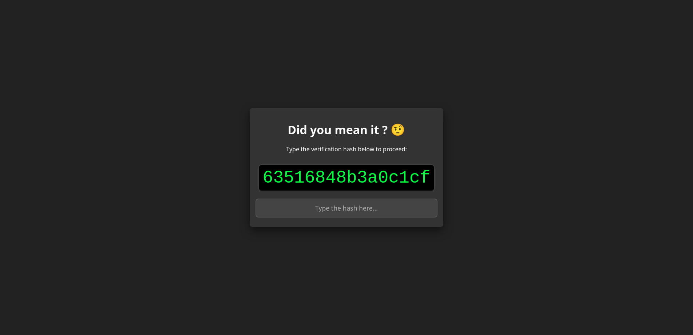

# Do you mean it ? 🤨
### A Firefox productivity extension that makes sure you *really* wanted to visit that website.

## What it does
This extension acts as a speed bump for your brain. Instead of mindlessly opening a tab, you are forced to manually type a random 16-character hash to proceed. It is designed to be slightly annoying, because that's the only way you'll actually stop.

## Usage
* Click the extension icon to open the menu. Type a domain (like `x.com` or `wikipedia.org`) and hit "Add".
* When you try to visit a listed site, you'll be blocked. To get in, you have to type the code shown on the screen. If you really want to doomscroll, you have to earn it.
* Once unlocked, the site stays open as long as you are using it. If you close the tab, you have 5 seconds to change your mind and reopen it before it locks again.
* You can turn the extension off in the menu if you're having a weak day.

## Installation
1.  Download the `.xpi` file from the **Releases** section.
2.  Drag and drop it into any Firefox window.
3.  Click **Add**.

## Disclaimer
This extension was hella made by AI, I just tweaked stuff and set the general direction for everything plus the visuals. I did double check the code and behavior of course, but I only "supervised" the code, I did not write *all* of this.

Feel free to fork.
